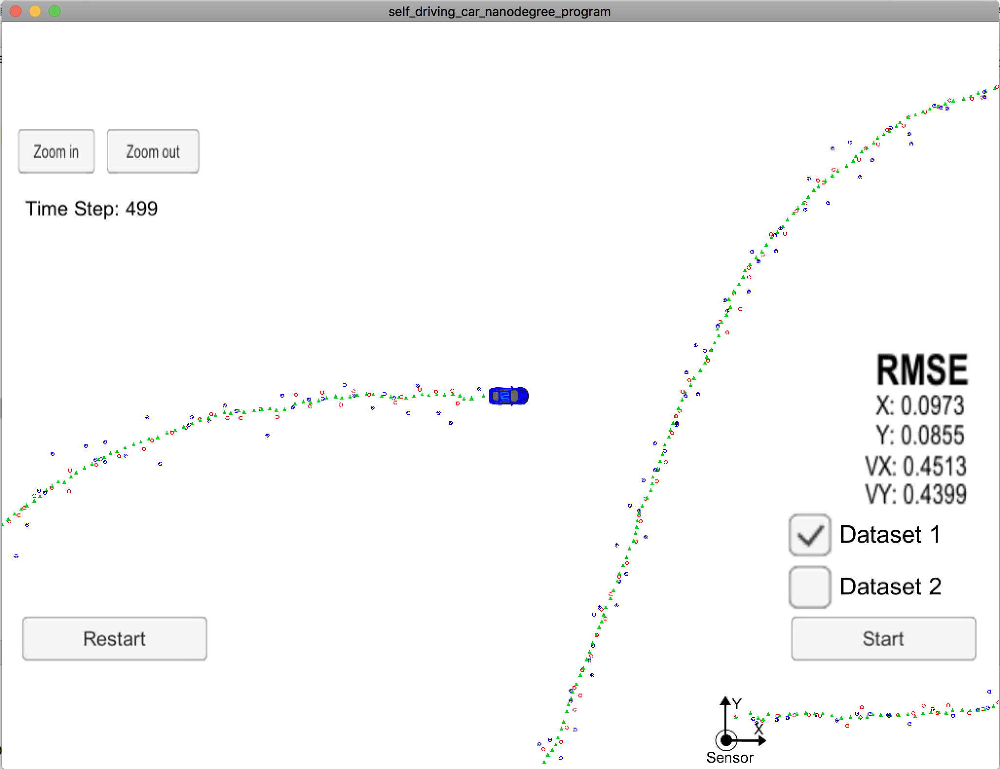

# Extended Kalman Filter project
Part of the udacity self-driving car nano-degree

## Build
- `#>` `git submodule update --init --recursive`
- `#>` `mkdir build && cd build && cmake .. && make`
- `#>` `./ExtendedKF`

Startup simulator and connect

## Run unit tests
- `#>` `make utest`
- `#>` `./test/utest`
